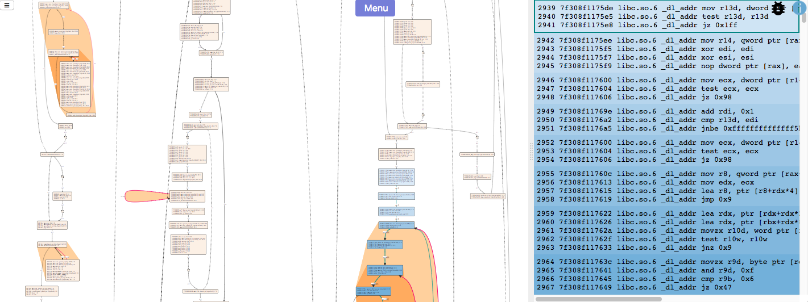
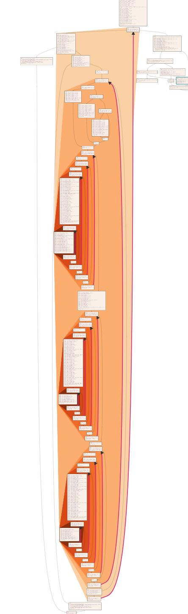

### CFGExplorer

CFGExplorer is an interactive visualization tool for analyzing control flow
graphs. For CFGs generated from instruction traces, CFGExplorer supports
linking between the trace and the node-link view. However, instruction traces
are optional. CFGExplorer can run with only the graph specification.

<p align="center">
  
  &nbsp;
  
</p>

[Click here](https://github.com/hdc-arizona/cfgexplorer/tree/develop/screenshots) for more screenshots.

## Usage notes:
* Works best with Google Chrome browser. Firefox sometimes mis-centers the graph.
* For large graphs (~1K nodes), the layout takes some time. The browser may pop up a warning saying the script is unresponsive. Please allow the script to continue. We are working on moving this layout server-side to avoid this issue.

## Requirements/Assumptions on Data Format:

### CFG
CFG should be given as a [DOT](https://www.graphviz.org/doc/info/lang.html) format file. 

* The instruction text should be specified the 'label' field of a node with instructions separated with newline. 
  * Example: `'B108 [shape=box, style=solid, label="main\n400590: mov dword ptr [rbp-0x68], 0xffffff9c 1 0\n400597: mov dword ptr [rbp-0x64], 0x0 1 0"];'`
  * The label can start with a newline followed by instructions or it can optionally start with the function name i.e. the function the node belongs to. In the above example, the node belongs to the function main.
* The edge count is optional but should be inside the 'label' field if specified. 
  * Example: `'B108 -> B113 [style=solid, color="black", label=" ct:1"];'`

### Instruction Trace
If specified, the instruction trace should be in ASCII format. It should contain one assembly instruction per line. The second column should contain the instruction address. 

  *  Example `'0 400460 max _start 31 ed xor ebp, ebp R:RBP=0000000000000000 R:RBP=0000000000000000 W:RBP=0000000000000000 W:GFLAGS=0000000000000246'`
    * In the example, second column contains the instruction address 400460. This is used to match the trace with the corresponding node in the CFG.

### Loop Finding
* For loop finding, the current requirement is that the CFG should have exactly one source node (i.e. the node with no incoming edges and one or more outgoing edges).

### Custom Highligting

CFGExplorer supports custom highligting of instructions specified by your own
supplied script. [Click
here](https://github.com/hdc-arizona/cfgexplorer/blob/develop/analysis_readme.md)
for details.


### Starting the flask server
```
export FLASK_APP=looper.py
python3 -m flask run
```

This runs the webapp on the following address:

`localhost:5000/cfgexplorer/`


### More Usage notes

* This software works best when used with latest version of Google Chrome.

* When loading new dataset, make sure the webpage is refreshed so that there is no data in memory from the previous dataset.

* When some source files such as .html, .css, .js files are changed (e.g., due to `git pull`, not by normal use), perform a hard reload to clear browser’s cache. This can be done in chrome by holding down Ctrl and clicking the Reload button. 

* On some occasions when assets such as .png, .jpg files etc. are changed, hard reload might not work. Clear the browser’s cache explicitly and then reload the webpage. In Chrome, this can be done by going to the `History` tab and go to `Clear Browsing Data` and choose `Cached images and files`.

* When running the webpage on localhost, the Flask server needs to be restarted whenever new code is pulled from github. Press Ctrl+c to stop the server and `python3 -m flask run` to restart it. This is because flask server caches the html file while its running.

### Licence

MIT. Click [here](LICENSE) for more details.


### Publications

Please cite:

Sabin Devkota and Katherine E. Isaacs. "CFGExplorer: Designing a Visual Control Flow Analytics System around Basic Program Analysis Operations." Computer Graphics Forum (EuroVis Proceedings), 37(3), 2018.
